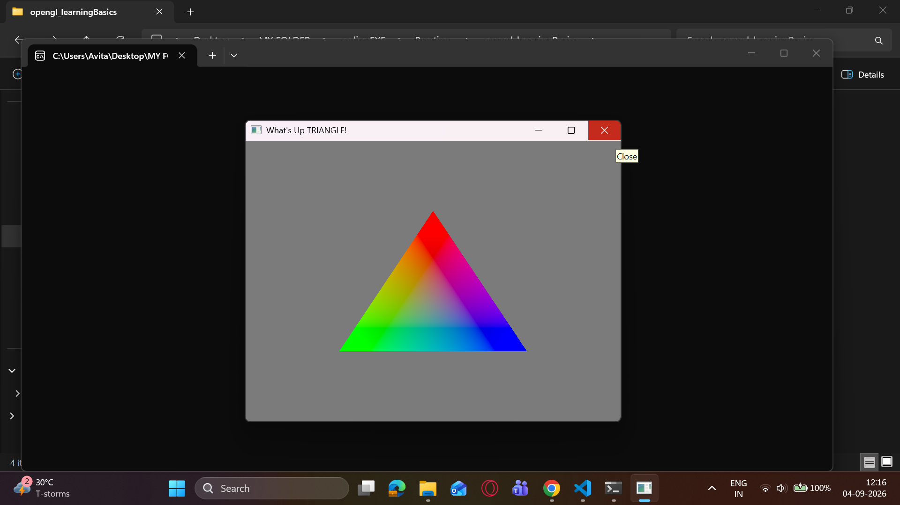
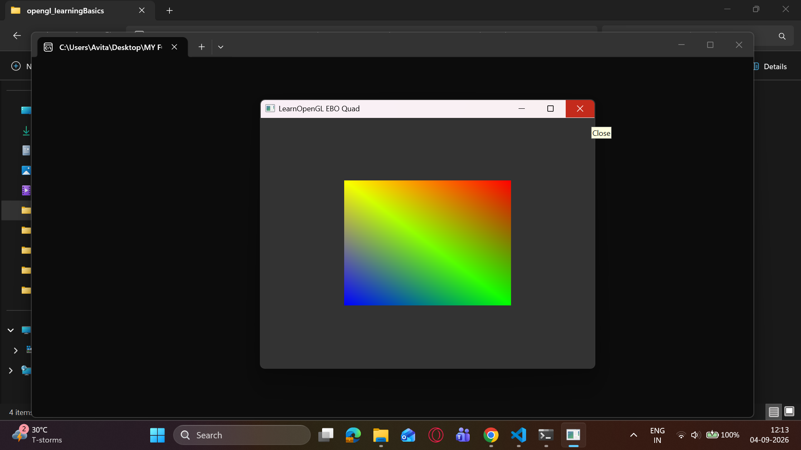
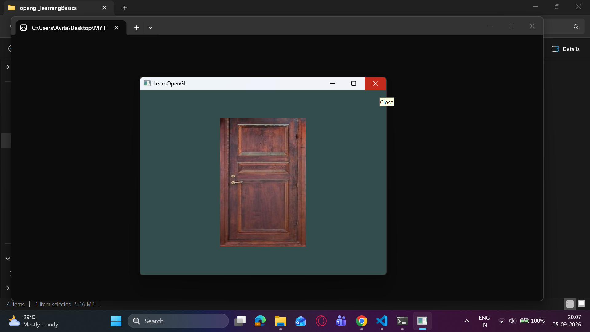
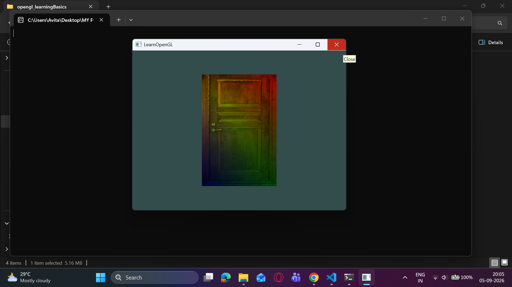
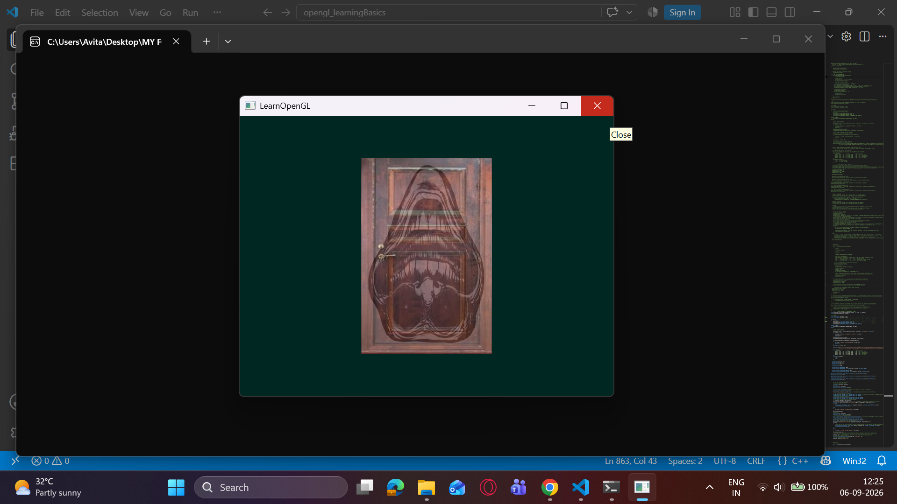

# MY OPENGL PRACTICE
# 🌌 Hello, OpenGL!

A step-by-step progression of graphics pipeline milestones, documenting my journey into low-level rendering context execution, custom GLSL shader compilation, and coordinate texture mapping.

---

## 🗺️ Learning Roadmap & Visual Milestones

Every file inside the `src/` directory represents a fully isolated and functional graphic rendering stage, linked to its corresponding GPU output viewport:

*   **`Window_GLFW.cpp`**
    *   *Technical Focus:* Initializing the GLFW environment, configuring viewport dimensions, managing Glad graphics context pointers, and constructing the fundamental event-polling render loop.
    *   *Output Output Preview:* *(Spins up a clean, responsive double-buffered empty window frame).*

*   **`Triangle_Shader.cpp`**
    *   *Technical Focus:* Stepping into the GPU pipeline. Generating Vertex Buffer Objects (VBO), configuring Vertex Array Objects (VAO), and executing hardcoded vertex/fragment shader pipelines.
    *   *Render Output:*
          

*   **`EBO.cpp`**
    *   *Technical Focus:* Optimizing index configurations by implementing Element Buffer Objects (EBO) to render a quad cleanly while reducing vertex memory redundancies.
    *   *Render Output:*
          

*   **`More_Shaders.cpp`**
    *   *Technical Focus:* Experimenting with vertex attributes, passing dynamic color data down the graphics pipeline, and playing with custom fragment shader math.
    *   *Render Output:*
          

*   **`shader.h`**
    *   *Technical Focus:* A custom header class blueprint built to automate reading, compiling, and linking GLSL shader source code files smoothly.

*   **`Textures.cpp`**
    *   *Technical Focus:* Experimenting with Texture generation, passing dynamic color data down the graphics pipeline, and playing with custom fragment shader math, and stb_image.h.
    *   *Render Output:*
          
          
          

---

## 🛠️ Environment & Toolkit
- **Language Architecture:** C++ (ISO Standard)
- **Graphics API:** OpenGL (Core Profile Layout)
- **Context Handling:** GLFW 3 + GLAD

---
*Documenting my computer graphics and low-level pipeline foundations during Semester 1 of B.Tech CSE.*
